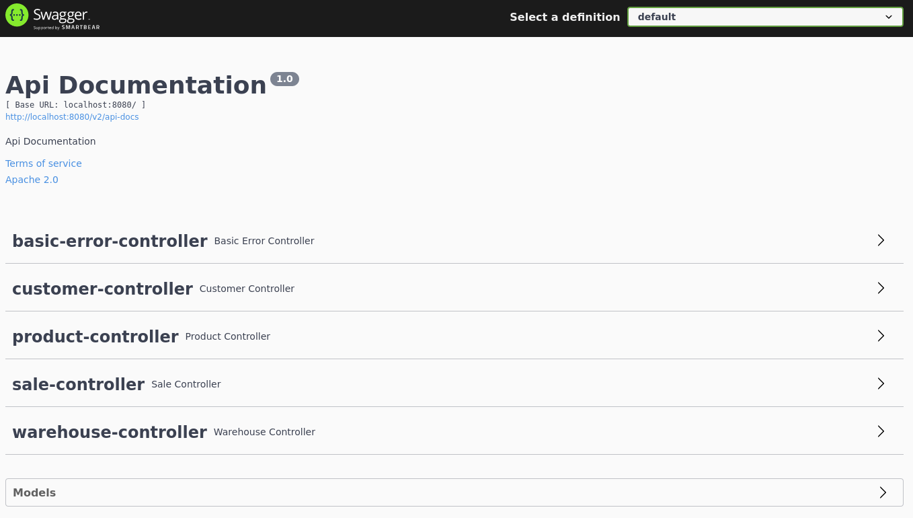
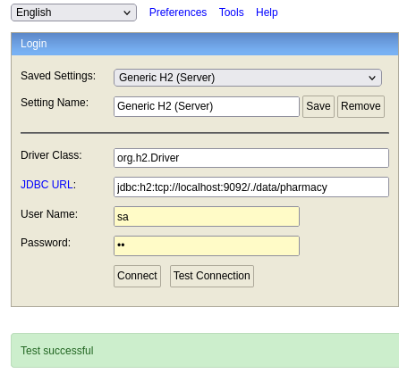

# Hurtownia farmaceutyczna

###Aplikacja dostarcza podstawowe uslugi wspierajace prace hurtowni farmaceutycznej.

###Dostepne uslugi:
* Produkty:
  * dodanie nowego produktu
  * zwrocenie listy produktow
* Magazyn:
  * dodanie produktow na stan
  * zwrocenie listy produktow ze stanami magazynowymi
* Klienci:
  * dodanie nowego klienta
  * zwrocenie listy klientow
* Sprzedaz:
  * zarejestrowanie sprzedazy
  * wyswietlenie historii sprzedazy dla klienta lub produktu

###Uruchomienie
* Aplikacja wymaga srodowiska JAVA oraz Maven.
* Nalezy pobrac repozytorium git.
* Nalezy wejsc do pobranego katalogu i wywolac komende ``mvn clean install``
* W celu uruchomienia aplikacji nalezy wywolac komende ``java -jar target/pharma-warehouse-0.5.0.jar``

### SwaggerUI
``http://localhost:8080/swagger-ui/index.html#/``

### Terminal bazy H2
``http://localhost:8080/h2-ui``

